## Connect XinaBox xChip CW02 WiFi to Azure IoT Hub in the cloud

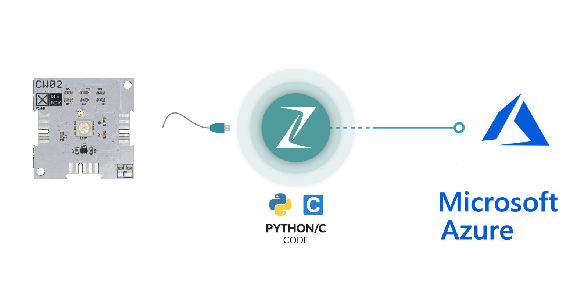

In this tutorial, you begin by learning the basics of working with your
XinaBox CW02 WiFi and SL06 gesture sensor xChips using [Zerynth Studio](https://www.zerynth.com/zerynth-studio/).

You will also learn how to connect your [CW02](http://wiki.xinabox.cc/CW02_-_Wi-Fi_%26_Bluetooth_Core) xChip device to the Azure
cloud by using [[Azure IoT
Hub]](https://docs.microsoft.com/en-us/azure/iot-hub/iot-hub-what-is-iot-hub).

## What you need to do

Connect the XinaBox [CW02](http://wiki.xinabox.cc/CW02_-_Wi-Fi_%26_Bluetooth_Core) WiFi xChip to an IoT hub that you create.

Run a sample application on xChip [CW02](http://wiki.xinabox.cc/CW02_-_Wi-Fi_%26_Bluetooth_Core) to fetch time from the internet,
and ambient light data from the xChip [SL06(APDS-9960)](http://wiki.xinabox.cc/SL06_-_Gesture).

This sample application will also send the collected data to your IoT
hub.

## What you will learn

-   How to create an IoT hub and register the XinaBox [CW02](http://wiki.xinabox.cc/CW02_-_Wi-Fi_%26_Bluetooth_Core) WiFi xChip.

-   How to connect the XinaBox [CW02](http://wiki.xinabox.cc/CW02_-_Wi-Fi_%26_Bluetooth_Core) WiFi xChip to your computer, and to
    the xChip [SL06(APDS-9960)](http://wiki.xinabox.cc/SL06_-_Gesture).

-   How to collect data from the xChip [SL06(APDS-9960)](http://wiki.xinabox.cc/SL06_-_Gesture) using the
    provided sample application which executes in the XinaBox [CW02](http://wiki.xinabox.cc/CW02_-_Wi-Fi_%26_Bluetooth_Core) WiFi
    xChip.

-   How to send the data collected from the internet and the [SL06(APDS-9960)](http://wiki.xinabox.cc/SL06_-_Gesture)
    xChip to your IoT hub.

## What you need for this tutorial

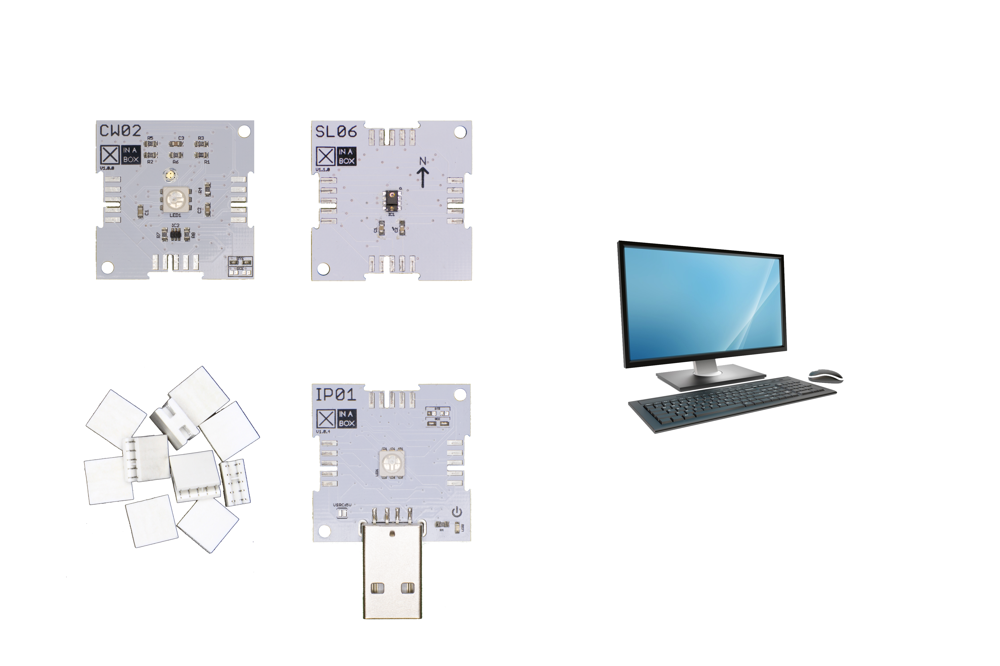

You will require the following before proceeding:

-   XinaBox IP01 xChip, 

-   XinaBox CW02 xChip, 

-   XinaBox [SL06(APDS-9960)](http://wiki.xinabox.cc/SL06_-_Gesture)
    xChip.

-   A Computer with the latest [Zerynth Studio](https://www.zerynth.com/zerynth-studio/).

-   A free USB socket on your computer.

-   Access to the internet via a wireless router.

## Create an IoT hub

1.  In the [[Azure portal]](https://portal.azure.com/),
    click **New** \> **Internet of Things** \> **IoT Hub**.

> 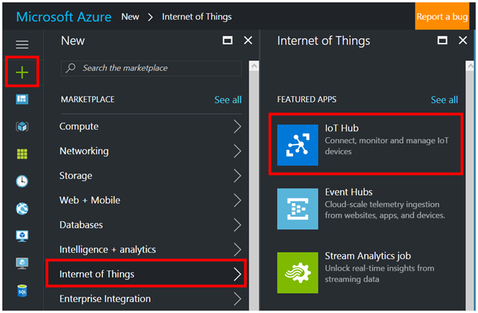

2.  In the **IoT hub** pane, enter the following information for your
    IoT hub:

> **Name**: The name you have chsen for your new IoT hub. If the name
> you enter is valid, a green check mark appears.
>
> **Pricing and scale tier**: Choose the free F1 tier, which is
> sufficient for your sample application. See [[pricing and scale
> tier]](https://azure.microsoft.com/pricing/details/iot-hub/).
>
> **Resource group**: Create a resource group to host the IoT hub or use
> an existing one. See [[Using resource groups to manage your Azure
> resources]](https://docs.microsoft.com/en-us/azure/azure-resource-manager/resource-group-portal).
>
> **Location**: Choose a location closest to your location.
>
> **Pin the dashboard**: Check this option for easy access to your IoT
> hub from the dashboard.
>
> 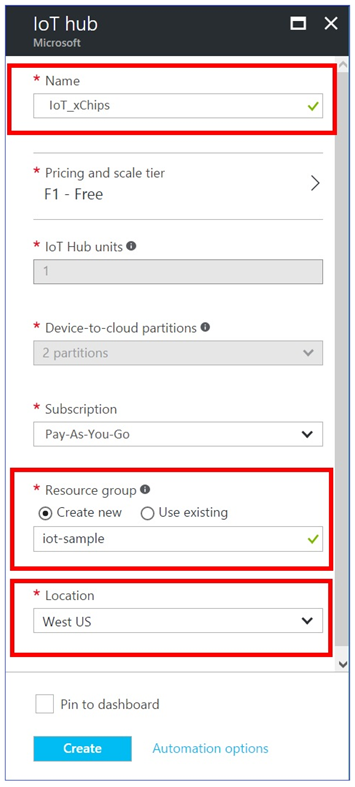

3.  Click **Create**. It could take a few minutes for your IoT hub to be
    created. You can see progress in the **Notifications** pane.

> 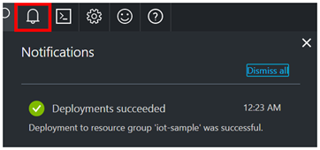

4.  Once your IoT hub is created, click it from the dashboard. Make a
    note of the **Hostname**, and then click **Shared access policies**.

> 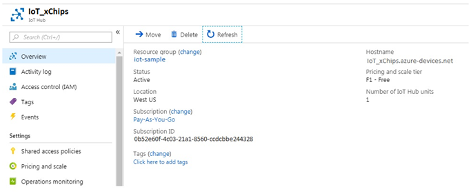

5.  In the **Shared access policies** pane, click
    the **iothubowner** policy, and then copy and make a note of
    the **Connection string** of your IoT hub. For more information,
    see [[Control access to IoT
    Hub]](https://docs.microsoft.com/en-us/azure/iot-hub/iot-hub-devguide-security).

> 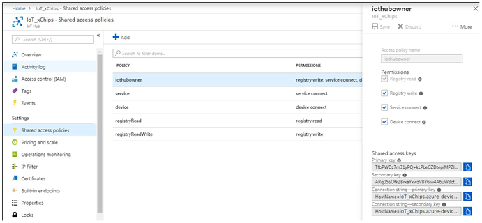

## Register a device in the IoT hub for the your device

1.  In the [[Azure portal]](https://portal.azure.com/), open
    your IoT hub.

2.  Click **IoT devices under Explorers**.

3.  In the Device Explorer pane, click **Add** to add a device to your
    IoT hub.

> 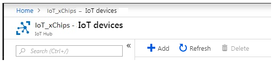
>
> 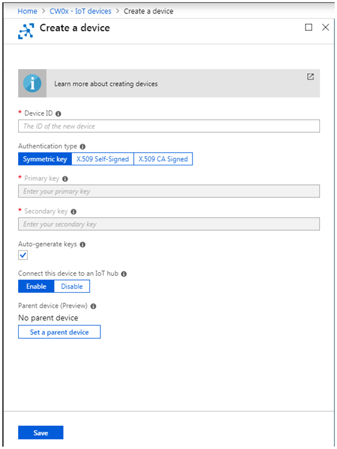

4.  Add the following details.

**Device ID:** The ID of the new device.

**Authentication Type:** Select Symmetric Key.

**Auto Generate Keys:** Check this field.

**Connect device to IoT Hub:** Click Enable.

5.  Click **Save**.

6.  After the device is created, open the device in the **IoT devices
    Explorer** pane.

> 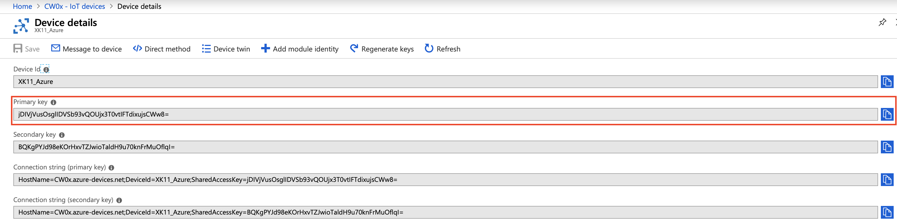

7.  Make a note of the **`primary key`** and copy it for later use.

## Connect the XinaBox Wifi xChip [CW02](http://wiki.xinabox.cc/CW02_-_Wi-Fi_%26_Bluetooth_Core) and xChip [SL06(APDS-9960)](http://wiki.xinabox.cc/SL06_-_Gesture) to your computer

Make sure your XinaBox xChips are arranged as follows.

Plug the XinaBox [IP01](http://wiki.xinabox.cc/IP01_-_USB_Programming_Interface) xChip, with [CW02](http://wiki.xinabox.cc/CW02_-_Wi-Fi_%26_Bluetooth_Core) xChip and [SL06(APDS-9960)](http://wiki.xinabox.cc/SL06_-_Gesture) xChip connected as
above, into a USB port on your computer.

## Prepare the Zerynth Studio for the XinaBox xChips

1.  Install Zerynth Studio

2.  Make sure to install `r2.1.2` release.
    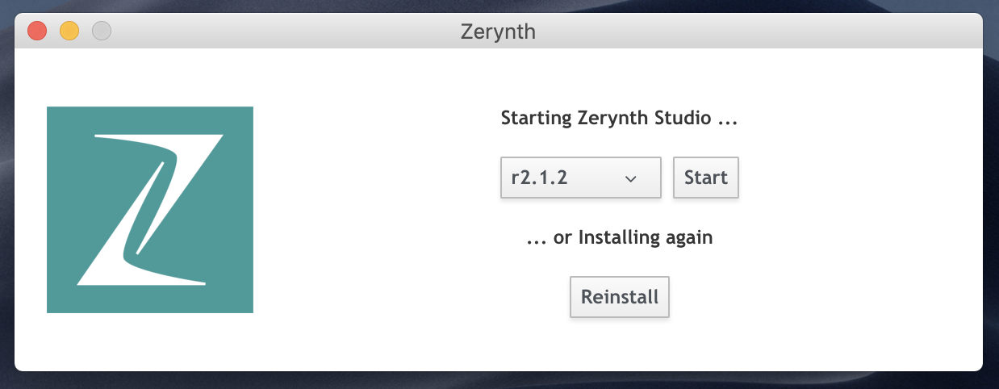

## Virtualize your CW02(ESP32)

Once connected on a USB port, if drivers have been correctly installed, the XinaBox CW02 device is recognized by Zerynth Studio. 

**The next steps are:**

* Select the XinaBox CW02 on the Device Management Toolbar (disambiguate if necessary),
* Register the device by clicking the “`Z`” button from the Zerynth Studio,
* Create a Virtual Machine for the device by clicking the “`Z`” button for the second time,
* Virtualize the device by clicking the “`Z`” button for the third time.

**After virtualization, the XinaBox CW02 is ready to be programmed and the Zerynth scripts uploaded.**

## Collect sensor data and send it to your IoT hub

In this section, you use the Zerynth Studio to open, verify, and load a
sample application onto the XinaBox WiFi xChip CW02.

The application collects time data off an internet time server, and data
from the XinaBox sensor xChip SL06, once every 30 seconds, and then
sends the data to your IoT hub.

### Download the sample application from GitHub and load it into the Zerynth Studio

The XinaBox sample application is hosted on GitHub.

Clone the sample repository from GitHub that contains the sample
application.

To clone the sample repository, follow these steps:

1.  Open a command prompt or a terminal window.

2.  Go to a folder where you want the sample application to be saved.

3.  Run the following command:

>   git clone
>   https://github.com/XinaBoxSamples/iot-hub-xinabox-cw02-client-app.git

4.  In Zerynth Studio, open \"**Project Browser-\>Open**\" and navigate to the folder which contains the sample application.

5.  Open the `main.py` file of the sample application.

> 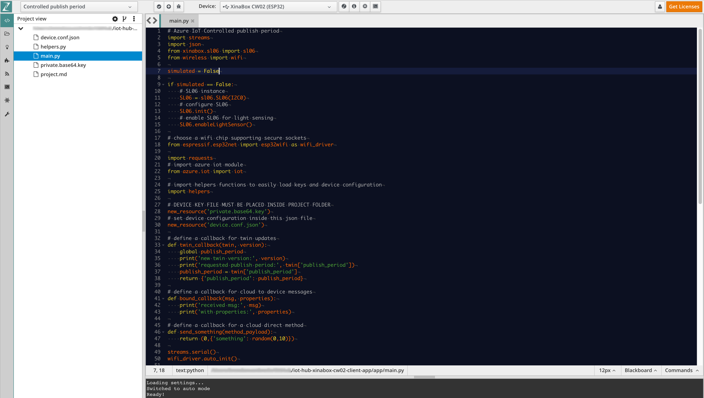

## Modify the sample application

1. Scroll down `main.py` to line 52, as seen below:

> 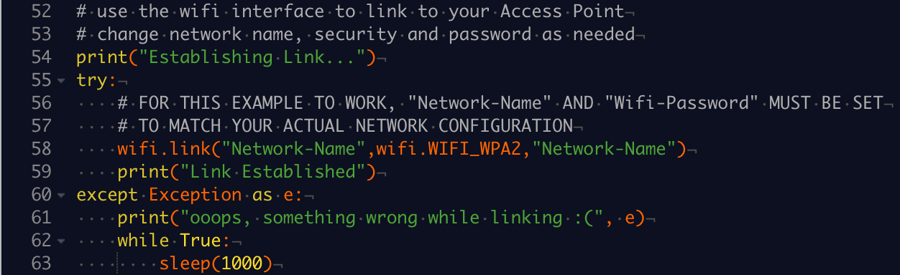

2. Modify the required fields to connect your Access Point,

3. Save the file,

4. Navitage to and open the file `private.based64.key`,

5. Paste the copied `private key` into the file,

> 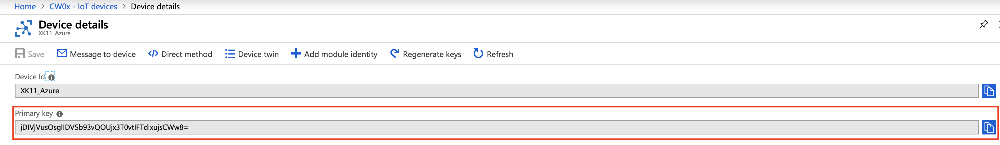

6.  Navitage to and open the file `device.conf.json`,

7. Modify the required fields to connect match your IoT Hub settings as well as the Device details.

8.  Paste the Hub Name into the **`"hubb_id"`** field

    Paste your Device Id into the **`"device_id"`** field

9. Save the file,

**Your Zerynth Script is now ready to be uploaded.**

## Don't have a real [SL06(APDS-9960)](http://wiki.xinabox.cc/SL06_-_Gesture) sensor?

The sample application can simulate ambient light in
case you don't have a real [SL06(APDS-9960)](http://wiki.xinabox.cc/SL06_-_Gesture) sensor. To set up the sample
application to use simulated data, follow these steps:

1.  Open the `main.py` file in the app folder.

2.  Locate the below line of code and change the value from
    `False` to `True`:

    `simulated = False`

    

3.  Save the file with Control-S.

## Deploy the sample application to the XinaBox CW02 WiFi xChip

1.  In the Zerynth Studio, select the virtualized device from the “Device Management Toolbar” and click the dedicated “upload” button of Zerynth Studio.

    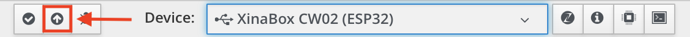

**Verify the sample application is running successfully**

If you see the following output from the console window, the
sample application is running successfully.

Note that the message log below includes messages sent from the xChip
CW02 device to Azure, and also 1 message sent from Azure to the xChip CW02 device.

The message is highlighted in red in the image below.

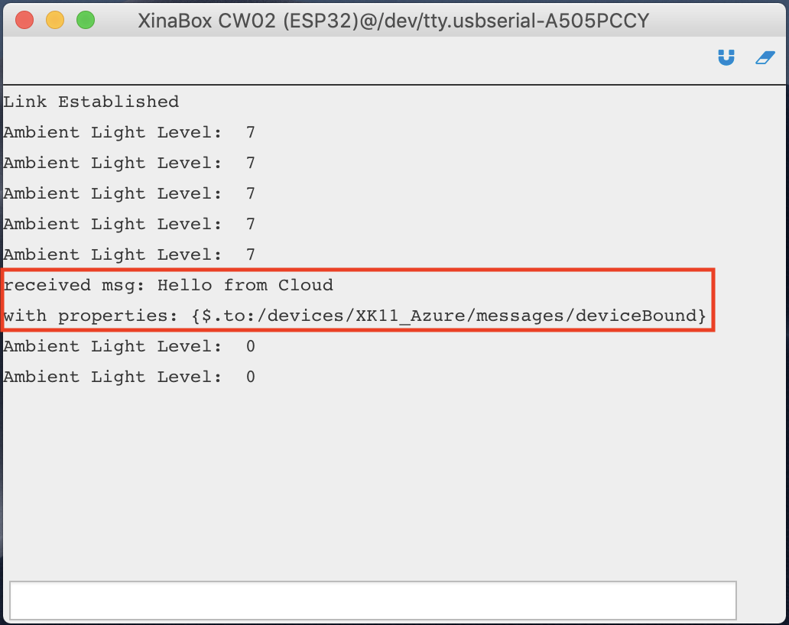

The following image shows how the message was sent from the
\"Device-\>Message to device\" menu in Azure.

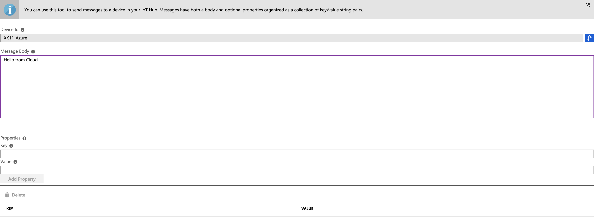

## Next steps

You have successfully connected an XinaBox CW02 xChip to the Azure IoT
hub you created, and sent the captured sensor data to your IoT hub.

You have now learned how to run a sample application that collects
sensor data and sends it to an Azure IoT hub. To explore how to store,
analyze and visualize the data from this application in Azure using a
variety of different services, please click on the following lessons:

-   [[Manage cloud device messaging with
    iothub-explorer]](https://docs.microsoft.com/en-us/azure/iot-hub/iot-hub-explorer-cloud-device-messaging)

-   [[Save IoT Hub messages to Azure data
    storage]](https://docs.microsoft.com/en-us/azure/iot-hub/iot-hub-store-data-in-azure-table-storage)

-   [[Use Power BI to visualize real-time sensor data from Azure IoT
    Hub]](https://docs.microsoft.com/en-us/azure/iot-hub/iot-hub-live-data-visualization-in-power-bi)

-   [[Use Azure Web Apps to visualize real-time sensor data from Azure
    IoT
    Hub]](https://docs.microsoft.com/en-us/azure/iot-hub/iot-hub-live-data-visualization-in-web-apps)

-   [[Weather forecast using the sensor data from your IoT hub in Azure
    Machine
    Learning]](https://docs.microsoft.com/en-us/azure/iot-hub/iot-hub-weather-forecast-machine-learning)

-   [[Remote monitoring and notifications with Logic
    Apps]](https://docs.microsoft.com/en-us/azure/iot-hub/iot-hub-monitoring-notifications-with-azure-logic-apps)
