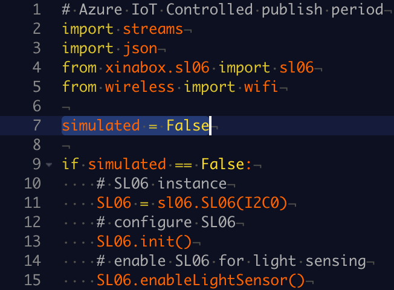

# IoT Hub XinaBox CW02 Client application 

> This repo contains the source code to help you get familiar with Azure IoT using the XK11 Iot starter kit.

This repo contains an [Zerynth Studio](https://www.zerynth.com/zerynth-studio/) application that runs on board [XinaBox CW02](http://wiki.xinabox.cc/CW02_-_Wi-Fi_%26_Bluetooth_Core) with a xChip [SL06(APDS-9960)](http://wiki.xinabox.cc/SL06_-_Gesture) advanced Gesture detection, Proximity detection, Digital Ambient Light Sense (ALS) and Color Sense (RGBC), and then sends these data to your IoT hub. At the same time, this application receives Cloud-to-Device message from your IoT hub, and takes actions according to the C2D command.

## Create your Azure IoT hub
Follow [this page](https://docs.microsoft.com/en-us/azure/iot-hub/iot-hub-create-through-portal) to prepare your Azure IoT hub and register your device.

## Connect your sensor with your board
### Connect with a physical SL06(APDS-9960)
You can follow the image to connect your SL06(APDS-9960) with your XinaBox CW02.

### DON'T HAVE A PHYSICAL SL06(APDS-9960)?
The sample application can simulate ambient light in
case you don't have a real [SL06(APDS-9960)](http://wiki.xinabox.cc/SL06_-_Gesture) sensor. To set up the sample
application to use simulated data, follow these steps:

1.  Open the `main.py` file in the app folder.

2.  Locate the below line of code and change the value from
    `False` to `True`:

    `simulated = False`

    

3.  Save the file with Control-S.

### Send Cloud-to-Device command
You can send a C2D message to your device. You can see the device prints out the message and blinks once receiving the message.